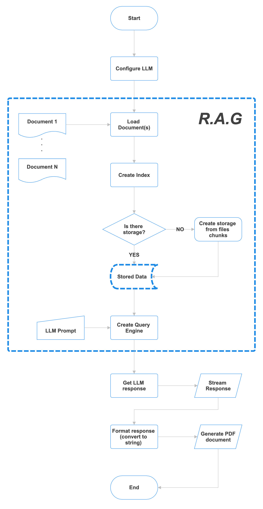

# li2doc

Python app that generates a summarized document from multiple files of different types (pdf, doc, csv, html, etc...).

This project implements a Retrieval-Augmented Generation (RAG) pipeline, using LlamaIndex.

## About (Flowchart)

- The system first retrieves relevant text passages from a data chunks derivated from defined documents (files/).
- The retrieved passages are then used as input for a language generation model, which generates a summary or response that incorporates information and ideas from the original passages. 
- This generated response is intended to be more coherent, informative, and relevant to the user's query than a traditional generation-only approach.
- The flowchart ends with the successful creation and saving of the PDF file, allowing users to easily review and reference their responses in a convenient format.



## Requirements

- Python ==3.12
- Node >12

## Setup

### Install Python Dependencies

```sh
pip install -r requirements.txt
```

### Install Node Dependencies

```sh
npm install
```

### Install Ollama

Download

- [macOS](https://ollama.com/download/Ollama-darwin.zip)
- [Windows](https://ollama.com/download/OllamaSetup.exe)
- [Linux](https://github.com/ollama/ollama/blob/main/docs/linux.md)

#### Manual install instructions

```sh
curl -fsSL https://ollama.com/install.sh | sh
```

## Usage

```sh
npm start
```

This will start the python script, load data from `./files` and show the program output.

### Server

Run the nitro server using the following command

```sh
npm run serve:mac
```

### Scripts

Please update the `.env` file!

#### Download

Download a model using the following command

```sh
npm run model:download
```

#### Load

Load a model using the following command

```sh
npm run model:load
```

#### Prompt it

Send a prompt to a model using the following command

```sh
npm run model:prompt "Type here the content of the prompt..."
```

## Authors

- jraleman
